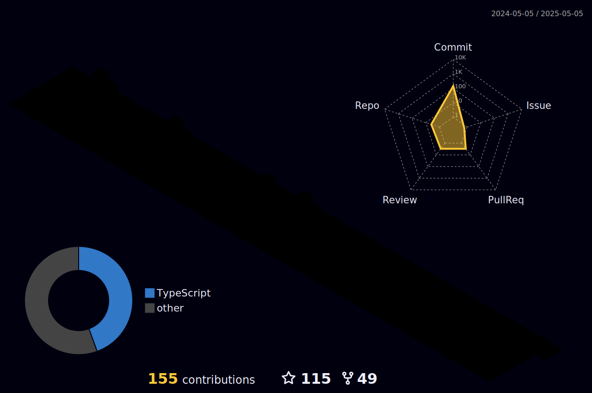

  
  
  

  
 |  |  |  
 | ----------- | ----------- |

 

   

  

  
  <h1 align="center">
    <a href="https://www.linkedin.com/in/luizinfected/">Luiz Costa</a>
  </h1>
  
  

    I am a Cyber Security graduate and currently a Full Stack Developer with solid knowledge in Back-end (Python, NodeJS, PHP) and Front-end (ReactJS, NextJS, TypeScript, JavaScript). I also have experience with modern and scalable architectures, including microservices, concurrency, and system integration using Docker. I work with relational databases like MySQL and am familiar with ORMs such as SQLAlchemy and TypeORM, as well as version control and collaboration tools like GIT.

I knowledge in Infrastructure as Code (IaC) and automation, exploring tools like Terraform. I am also expanding my knowledge of AWS, where I have worked with services like S3, VPC, EC2, and IAM to configure and manage cloud environments in a scalable and secure manner.

I am always looking to improve my skills, embracing the challenges and opportunities of the ever-evolving tech world. I am dedicated, motivated, and open to new learning experiences and challenges, with a focus on continuous growth and innovation.
  

  
    

  

 

   
  

